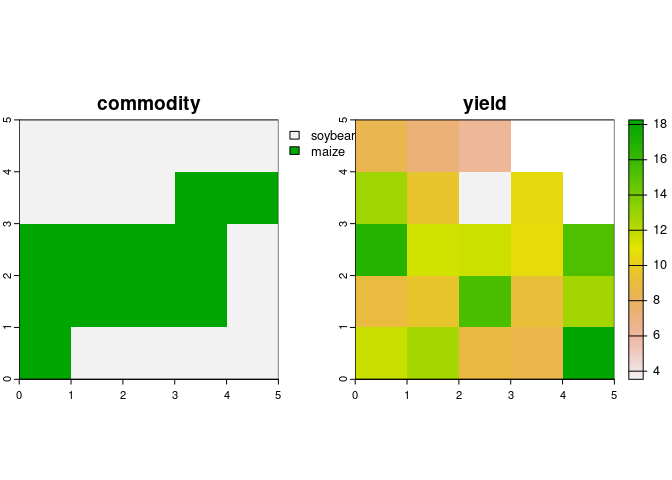

<!-- README.md is generated from README.Rmd. Please edit that file -->

# bitfield <a href='https://github.com/ehrmanns/bitfield/'></a>

<!-- badges: start -->
<!-- [](https://cran.r-project.org/package=) -->
<!-- [](https://doi.org/) -->

[](https://github.com/ehrmanns/bitfield/actions)
[](https://codecov.io/gh/ehrmanns/bitfield)
[](https://lifecycle.r-lib.org/articles/stages.html#experimental)

<!-- [](https://cran.r-project.org/package=) -->
<!-- badges: end -->

## Overview

This package is designed to capture the computational footprint of any
model workflow or output. It achieves this by encoding computational
decisions into sequences of bits (i.e.,
[bitfields](https://en.wikipedia.org/wiki/Bit_field)) that are
transformed to integer value. This allows storing a range of information
into a single column of a table or a raster layer, which can be useful
when documenting

- the metadata of any dataset by collecting information throughout the
  dataset creation process,
- a provenance graph that documents how a gridded modelled data product
  was built,
- intermediate data that accrue along a workflow, or
- a set of output metrics or parameters.

Think of a bit as a switch representing off and on states. A combination
of a pair of bits can store four states, and n bits can accommodate 2^n
states. These states could be the outcomes of (simple) tests that
document binary responses, cases or numeric values. The data produced in
that way could be described as meta-analytic or meta-algorithmic data,
because they can be re-used to extend an analysis pipeline or algorithm
by downstream applications.

## Installation

Install the official version from CRAN:

``` r
# install.packages("bitfield")
```

Install the latest development version from github:

``` r
devtools::install_github("EhrmannS/bitfield")
```

## Examples

``` r
library(bitfield)

library(dplyr, warn.conflicts = FALSE); library(CoordinateCleaner); library(stringr)
```

Let’s first load an example dataset

``` r
tbl_bityield$x                                       # invalid (259) and improbable (0) coordinate value
#>  [1]  25.3  27.9  27.8  27.0 259.0  27.3  26.1  26.5   0.0  25.7

tbl_bityield$y                                       # Inf and NaN value
#>  [1] 59.5 58.1 57.8 59.2  Inf 59.1 58.4 59.0  0.0  NaN

tbl_bityield$commodity                               # NA value or mislabelled term ("honey")
#>  [1] "soybean" "maize"   NA        "maize"   "honey"   "maize"   "soybean"
#>  [8] "maize"   "soybean" "maize"

tbl_bityield$yield                                   # correct range?!
#>  [1] 11.192915 11.986793 13.229386  4.431376 12.997422  8.548882 11.276921
#>  [8] 10.640715  9.010452 13.169897

tbl_bityield$year                                    # flags (*r)
#>  [1] "2021"  NA      "2021r" "2021"  "2021"  "2021"  "2021"  "2021"  "2021" 
#> [10] "2021"

# and there is a set of valid commodity terms
validComm <- c("soybean", "maize")
```

The first step is in creating what is called `registry` in `bitfield`.
This registry captures all the information required to build the
bitfield

``` r
yieldReg <- bf_registry(name = "yield_QA",
                        description = "this bitfield documents quality assessment in a table of yield data.")
```

Then, individual bit flags need to be grown by specifying the respective
mapping function. These functions create flags for the most common
applications, such as `bf_na()` (to test for missing values),
`bf_case()` (to test what case/class the observations are part
of),`bf_length()` (to count the number of digits of a variable), or
`bf_numeric()` to encode a numeric (floating point) variable as bit
sequence.

``` r
# tests for longitude availability
yieldReg <- 
  bf_na(x = tbl_bityield,                        # specify where to determine flags
        test = "x",                              # ... and which variable to test
        pos = 1,                                 # specify at which position to store the flag
        registry = yieldReg)                     # provide the registry to update

# test which case an observation is part of
yieldReg <- 
  bf_case(x = tbl_bityield, exclusive = FALSE,
          yield >= 11, yield < 11 & yield > 9, yield < 9 & commodity == "maize",
          registry = yieldReg)

# test the length (number of digits) of values
yieldReg <- 
  bf_length(x = tbl_bityield, test = "y",
            registry = yieldReg)
  
# store a simplified (e.g. rounded) numeric value
# yieldReg <-
#   bf_numeric(x = tbl_bityield, source = "yield", decimals = 3,
#              registry = yieldReg)
```

Various derived functions build on these and thus require bits according
to the same rules. The resulting data structure is a record of all the
things that are grown on the bitfield.

``` r
yieldReg
#>   width 6
#>   flags 3  -|--|---
#> 
#>   pos   encoding type    col
#>   1     0.0.1/0  na      x
#>   2     0.0.2/0  cases   
#>   4     0.0.3/0  length  y
```

This is, however, not yet the bitfield. The registry is merely the
instruction manual, so to speak, to create the bitfield and encode it as
integer, with the function `bf_encode()`.

``` r
(intBit <- bf_encode(registry = yieldReg))
#> # A tibble: 10 × 1
#>    bf_int1
#>      <int>
#>  1       4
#>  2       4
#>  3       4
#>  4      20
#>  5       0
#>  6      20
#>  7       4
#>  8      10
#>  9       9
#> 10       0
```

The bitfield can be decoded based on the registry with the function
`bf_decode()` at a later point in time, where the metadata contained in
the bitfield can be studied or extended in a downstream application.

``` r
bitfield <- bf_decode(x = intBit, registry = yieldReg, sep = "-")
#> # A tibble: 6 × 4
#> # Rowwise: 
#>   pos   name     flag  desc                                                     
#>   <chr> <chr>    <chr> <chr>                                                    
#> 1 1     na_x     0     "{FALSE} the value in column 'x' is not NA."             
#> 2 1     na_x     1     "{TRUE}  the value in column 'x' is NA."                 
#> 3 2:3   cases    00    "the observation has the case [yield >= 11]."            
#> 4 2:3   cases    01    "the observation has the case [yield < 11 & yield > 9]." 
#> 5 2:3   cases    10    "the observation has the case [yield < 9 & commodity == …
#> 6 4:6   length_y 000   "the bits encode the value length in column 'y'."

# -> prints legend by default, which is also available in bf_env$legend

tbl_bityield |>
  bind_cols(bitfield) |>
  kable()
```

|     x |    y | commodity |     yield | year  | bf_bin   |
|------:|-----:|:----------|----------:|:------|:---------|
|  25.3 | 59.5 | soybean   | 11.192915 | 2021  | 0-00-100 |
|  27.9 | 58.1 | maize     | 11.986793 | NA    | 0-00-100 |
|  27.8 | 57.8 | NA        | 13.229386 | 2021r | 0-00-100 |
|  27.0 | 59.2 | maize     |  4.431376 | 2021  | 0-10-100 |
| 259.0 |  Inf | honey     | 12.997422 | 2021  | 0-00-000 |
|  27.3 | 59.1 | maize     |  8.548882 | 2021  | 0-10-100 |
|  26.1 | 58.4 | soybean   | 11.276921 | 2021  | 0-00-100 |
|  26.5 | 59.0 | maize     | 10.640715 | 2021  | 0-01-010 |
|   0.0 |  0.0 | soybean   |  9.010452 | 2021  | 0-01-001 |
|  25.7 |  NaN | maize     | 13.169897 | 2021  | 0-00-000 |

The column `bf_binary`, in combination with the legend, can be read one
step at a time. For example, considering the first bit, we see that no
observation has an `NA` value and considering the second bit, we see
that observations 4 and 6 have a `yield` smaller than 9 and a
`commodity` value “maize”.

## Bitfields for other data-types

Not only tabular data are supported, but also gridded data such as
rasters (wip).

``` r
library(terra, warn.conflicts = FALSE)
#> terra 1.7.78

rst_bityield <- rast(system.file("ex/rst_bityield.tif", package = "bitfield"))
levels(rst_bityield$commodity) <- tibble(id = 1:3, commodity = c("soybean", "maize", "honey"))

plot(rst_bityield)
```



# To Do

- [ ] write unit tests
- [ ] include MD5 sum for a bitfield and update it each time the
  bitfield is grown further
- [ ] ensure everything is properly PROVy
  <https://www.w3.org/TR/prov-o/#Activity>, and document it
