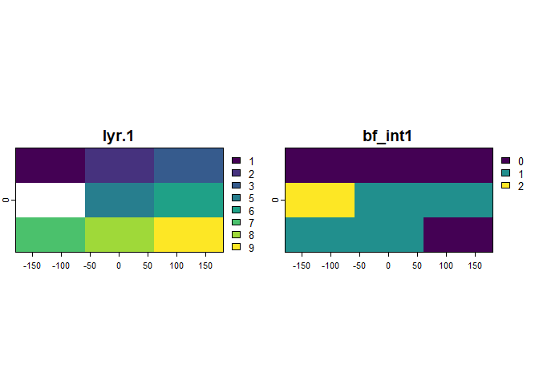

<!-- README.md is generated from README.Rmd. Please edit that file -->

# bitfield <a href='https://github.com/bitfloat/bitfield/'></a>

<!-- badges: start -->

[](https://cran.r-project.org/package=bitfield)
[](https://cran.r-project.org/package=bitfield)

[](https://github.com/bitfloat/bitfield/actions/workflows/R-CMD-check.yaml)
[](https://app.codecov.io/gh/bitfloat/bitfield)
[](https://lifecycle.r-lib.org/articles/stages.html#stable)

<!-- badges: end -->

## Overview

This package is designed to capture the computational footprint of any
model workflow or output. It achieves this by encoding computational
decisions into sequences of bits (i.e.,
[bitfields](https://en.wikipedia.org/wiki/Bit_field)) that are
transformed to integer values. This allows storing a range of
information into a single column of a table or a raster layer, which can
be useful when documenting

- the metadata of any dataset by collecting information throughout the
  dataset creation process,
- intermediate data that accrue along a workflow, or
- a set of output metrics or parameters.
- …

Think of a bit as a switch representing off and on states. A combination
of a pair of bits can store four states, and n bits can accommodate 2^n
states. These states could be the outcomes of (simple) tests that
document binary responses, cases or numeric values. The data produced in
that way could be described as meta-analytic or meta-algorithmic data,
because they can be re-used to extend an analysis pipeline or algorithm
by downstream applications.

## Installation

Install the official version from CRAN:

``` r
install.packages("bitfield")
```

Install the latest development version from github:

``` r
devtools::install_github("bitfloat/bitfield")
```

## Examples

``` r
library(bitfield)
library(dplyr, warn.conflicts = FALSE)
library(terra, warn.conflicts = FALSE)
#> terra 1.8.54
```

Let’s first load an example dataset

``` r
bf_tbl$x                                       # invalid (259) and improbable (0) coordinate value
#> [1]  25.3  27.9  27.8  27.0 259.0  27.3  26.1  26.5   0.0

bf_tbl$y                                       # Inf and NaN value
#> [1] 59.5 58.1 57.8 59.2  Inf 59.1 58.4  NaN  0.0

bf_tbl$commodity                               # NA value or mislabelled term ("honey")
#> [1] soybean maize   soybean <NA>    honey   maize   soybean maize   soybean
#> Levels: honey maize soybean

bf_tbl$yield                                   # correct range?!
#> [1] 11.192915 11.986793 13.229386  4.431376 12.997422  8.548882 11.276921
#> [8] 10.640715  9.010452

bf_tbl$year                                    # flags (*r)
#> [1] "2021"  NA      "2021r" "2021"  "2021"  "2021"  "2021"  "2021"  "2021"

# and there is a set of valid commodity terms
validComm <- c("soybean", "maize")
```

The first step is in creating what is called `registry` in `bitfield`.
This registry captures all the information required to build the
bitfield (note, this is merely a minimal tech demo, for additional
information, check the respective function documentations).

``` r
reg <- bf_registry(name = "yield_QA",
                   description = "this example bitfield documents quality assessment of yield data.")
```

Then, individual bit flags need to be grown by specifying the respective
protocols. These protocols create flags for the most common
applications, such as `na` (to test for missing values), `case` (to test
what case/class the observations are part of),`nChar` (to count the
number of characters of a variable), or `numeric` to encode a numeric
(floating point) variable as bit sequence.

``` r
# tests for longitude availability
reg <- bf_map(protocol = "na",                       # the protocol with which to build the bit flag
              data = bf_tbl,                         # specify where to determine flags
              x = x,                                 # ... and which variable to test
              pos = 1,                               # specify at which position to store the flag
              registry = reg)                        # provide the registry to update

# test which case an observation is part of
reg <- bf_map(protocol = "case", data = bf_tbl, registry = reg, na.val = 0,
              yield >= 11, yield < 11 & yield > 9, yield < 9 & commodity == "maize")
#> Lade nötiges Paket: purrr

# test the length (number of characters) of values
reg <- bf_map(protocol = "nChar", data = bf_tbl, registry = reg, 
              x = y)

# store a simplified (e.g. rounded) numeric value
reg <- bf_map(protocol = "numeric", data = bf_tbl, registry = reg, 
              x = yield, format = "half")
```

These are functions that represent the possible encoding types boolean
(`bool`), enumerated cases (`enum`), (signed) integers (`int`), and
numeric floating-point (`num`). The encoding type determines various
storage parameters of the resulting flags. This is, however, not yet the
bitfield. The registry is merely the instruction manual, so to speak, to
create the bitfield and encode it as integer, with the function
`bf_encode()`.

``` r
reg
#>   width 23
#>   flags 4  -|--|----|----------------
#> 
#>   pos encoding  type    col
#>   1   0.0.1/0   na      x
#>   2   0.0.2/0   case    yield-commodity
#>   4   0.0.4/0   nChar   y
#>   8   1.5.10/15 numeric yield

(field <- bf_encode(registry = reg))
#> # A tibble: 9 × 1
#>   bf_int1
#>     <int>
#> 1 1591704
#> 2 1591806
#> 3 1591965
#> 4  541806
#> 5 1460863
#> 6 3688518
#> 7 1591715
#> 8 2509138
#> 9 2246785
```

The bitfield can be decoded based on the registry with the function
`bf_decode()` at a later point in time or another workflow, where the
metadata contained in the bitfield can be used or extended in a
downstream application.

``` r
flags <- bf_decode(x = field, registry = reg, sep = "-")
#> # A tibble: 4 × 3
#>   pos   name                 desc                                              
#>   <chr> <chr>                <chr>                                             
#> 1 1:1   na_x                 'x' contains NA-values.                           
#> 2 2:3   case_yield-commodity The observations are distinguished into cases.    
#> 3 4:7   nChar_y              'y' is that many characters long.                 
#> 4 8:23  numeric_yield        'yield' is encoded as floating-point bit-sequence.

# -> prints legend by default, which is also available in bf_legend

bf_tbl |>
  bind_cols(flags) |>
  kable()
```

|     x |    y | commodity |     yield | year  | bf_bin                     |
|------:|-----:|:----------|----------:|:------|:---------------------------|
|  25.3 | 59.5 | soybean   | 11.192915 | 2021  | 0-01-1000-0100100110011000 |
|  27.9 | 58.1 | maize     | 11.986793 | NA    | 0-01-1000-0100100111111110 |
|  27.8 | 57.8 | soybean   | 13.229386 | 2021r | 0-01-1000-0100101010011101 |
|  27.0 | 59.2 | NA        |  4.431376 | 2021  | 0-00-1000-0100010001101110 |
| 259.0 |  Inf | honey     | 12.997422 | 2021  | 0-01-0110-0100101001111111 |
|  27.3 | 59.1 | maize     |  8.548882 | 2021  | 0-11-1000-0100100001000110 |
|  26.1 | 58.4 | soybean   | 11.276921 | 2021  | 0-01-1000-0100100110100011 |
|  26.5 |  NaN | maize     | 10.640715 | 2021  | 0-10-0110-0100100101010010 |
|   0.0 |  0.0 | soybean   |  9.010452 | 2021  | 0-10-0010-0100100010000001 |

The column `bf_bin`, in combination with the legend, can be read one
step at a time. For example, considering the first bit, we see that no
observation has an `NA` value and considering the second bit, we see
that observations 4 and 6 have a `yield` smaller than 9 and a
`commodity` value “maize” (case 3 with binary value `11`).

Moreover, more computation friendly, we can also separate the bitfield
into distinct columns per flag and we can load the decoded values from
the package environment `.GlobalEnv`.

``` r
bf_decode(x = field, registry = reg, verbose = FALSE)
#> # A tibble: 9 × 4
#>   na_x  `case_yield-commodity` nChar_y numeric_yield   
#>   <chr> <chr>                  <chr>   <chr>           
#> 1 0     01                     1000    0100100110011000
#> 2 0     01                     1000    0100100111111110
#> 3 0     01                     1000    0100101010011101
#> 4 0     00                     1000    0100010001101110
#> 5 0     01                     0110    0100101001111111
#> 6 0     11                     1000    0100100001000110
#> 7 0     01                     1000    0100100110100011
#> 8 0     10                     0110    0100100101010010
#> 9 0     10                     0010    0100100010000001

# access values manually
ls(.GlobalEnv)
#> [1] "bf_legend"            "case_yield-commodity" "field"               
#> [4] "flags"                "na_x"                 "nChar_y"             
#> [7] "numeric_yield"        "reg"                  "validComm"

.GlobalEnv[["nChar_y"]]
#> [1] 8 8 8 8 6 8 8 6 2
```

Beware that numeric values that have been encoded in this way, likely
have a lower precision than the input values (which may not be a problem
in the frequent case where only rounded values are of interest). This
can be adjusted by setting the respective parameters in the protocol
that encodes numeric values (a vignette explaining this in detail will
follow).

``` r
old <- options(pillar.sigfig = 7)
tibble::tibble(original = bf_tbl$yield, 
               bitfield = .GlobalEnv$numeric_yield)
#> # A tibble: 9 × 2
#>    original  bitfield
#>       <dbl>     <dbl>
#> 1 11.19292  11.1875  
#> 2 11.98679  11.98438 
#> 3 13.22939  13.22656 
#> 4  4.431376  4.429688
#> 5 12.99742  12.99219 
#> 6  8.548882  8.546875
#> 7 11.27692  11.27344 
#> 8 10.64072  10.64062 
#> 9  9.010452  9.007812
options(old)
```

## Bitfields for raster data

An interesting use case is in encoding metadata for modelled gridded
data. In the newest version of this package, this is possible simply by
providing a raster instead of a table to the functions.

``` r
library(terra)

# define an example dataset
bf_rst <- rast(nrows = 3, ncols = 3, vals = bf_tbl$commodity, 
               names = "commodity") # with levels
bf_rst$yield <- rast(nrows = 3, ncols = 3, vals = bf_tbl$yield) # numeric

# build the registry
reg <- bf_registry(name = "reg_raster",
                   description = "bitfield for rasters.")

reg <- bf_map(protocol = "na", data = bf_rst, registry = reg,
              x = commodity)
reg <- bf_map(protocol = "range", data = bf_rst, registry = reg, 
              x = yield, min = 5, max = 11)
reg <- bf_map(protocol = "category", data = bf_rst, registry = reg,
              x = commodity, na.val = 0)
              
# encode as bitfield (and make raster out of it)
field <- bf_encode(registry = reg)
rst_field <- rast(bf_rst$yield, vals = field, names = names(field))

# decode (gridded) bitfield somewhere downstream
flags <- bf_decode(x = values(rst_field, dataframe = TRUE), registry = reg)
#> # A tibble: 3 × 3
#>   pos   name               desc                                              
#>   <chr> <chr>              <chr>                                             
#> 1 1:1   na_commodity       'commodity' contains NA-values.                   
#> 2 2:2   range_yield        The 'yield' values are between '5' and '11'.      
#> 3 3:4   category_commodity 'commodity' is encoded as categorical enumeration.

bind_cols(flags, field)
#> # A tibble: 9 × 4
#>   na_commodity range_yield category_commodity bf_int1
#>   <chr>        <chr>       <chr>                <int>
#> 1 0            0           10                       2
#> 2 0            0           01                       1
#> 3 0            0           10                       2
#> 4 1            0           00                       8
#> 5 0            0           00                       0
#> 6 0            1           01                       5
#> 7 0            0           10                       2
#> 8 0            1           01                       5
#> 9 0            1           10                       6

plot(c(bf_rst, rst_field))
```


